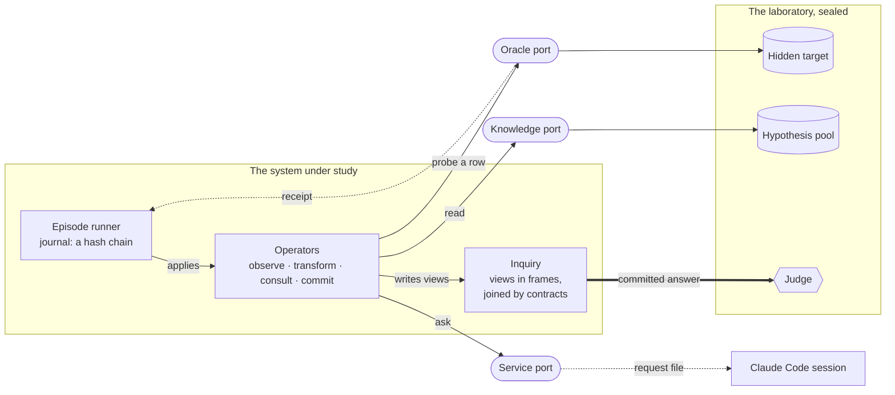
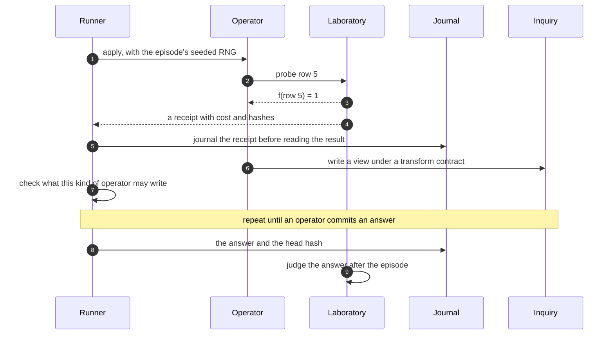
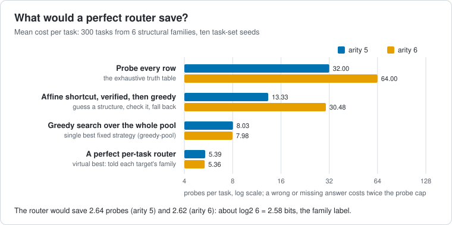
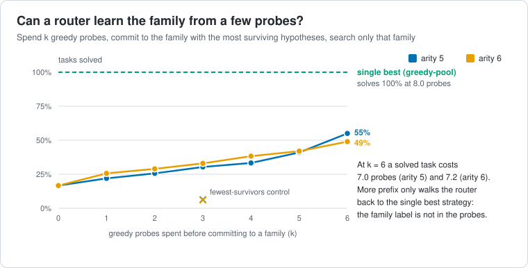
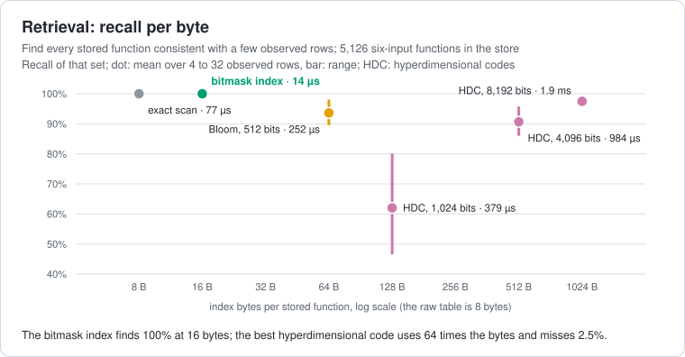
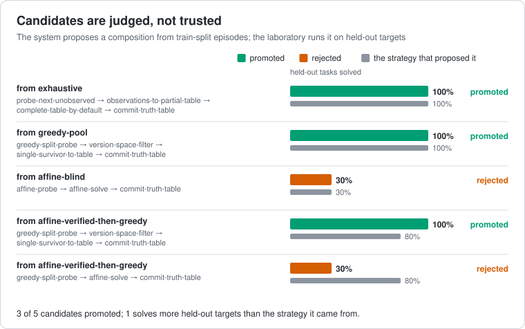
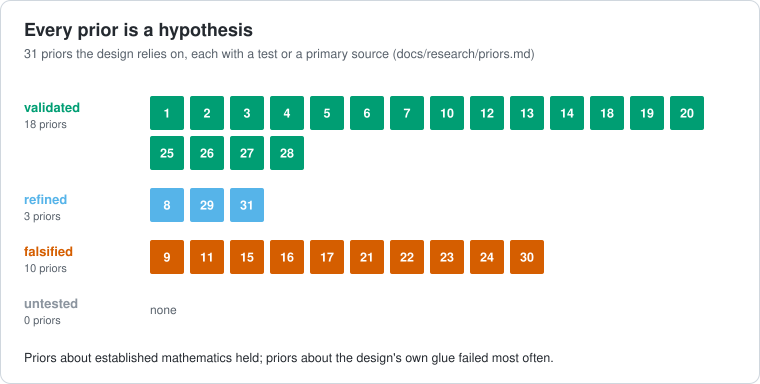
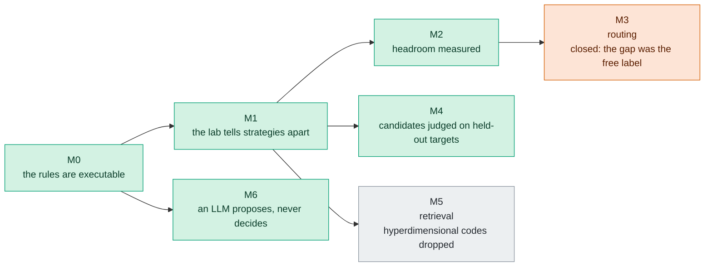
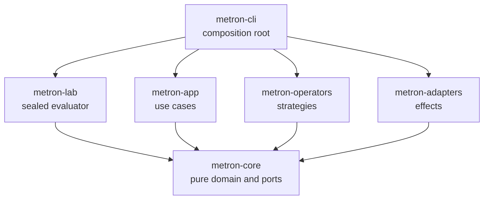

# Metron

**Hexagonal Cognitive Kernel: a laboratory where a resource-bounded system
learns hidden Boolean functions through several representations, and where
every claim has to survive measurement.**

[](https://github.com/kmosoti/Metron/actions/workflows/ci.yml)

The system never sees the function it is trying to learn. It asks questions
through a port, pays for every answer with a receipt, and commits a guess
that the laboratory judges once the episode is over. These rules are not a
convention: the build fails if any of them is broken.

## The picture



Four rules hold everywhere, and `cargo test` checks them on every build: the
core is pure, the laboratory owns ground truth, every external operation
leaves a receipt, and representations meet only through explicit transform
contracts that say what they preserve, lose and assume.

## One episode



The same manifest and seed always produce the same journal head, so any run
can be replayed and audited, including runs that paused to ask a language
model a question.

## What the laboratory has found

**A perfect router would save probes.** Six structural families, ten
task-set seeds. A clairvoyant per-task router beats the best fixed strategy
by about log2 6 probes: exactly the information in the family label.



**But the label it routes on is not in the probes.** A real router has to
learn the family from the same probes it is trying to save. It cannot: more
prefix only walks it back to the single best strategy.



**Exact beats hyperdimensional for these objects.** Retrieving every stored
function consistent with a few observed rows, the bitmask index is complete,
smallest and fastest.



**The system proposes; the laboratory decides.** Compositions extracted from
episodes are judged on held-out targets, never on the episodes that produced
them.



**Every prior is a hypothesis.** Whatever the design relies on, whether
recalled, cited or derived, carries a test or a primary source.



These pictures are drawn from the committed reports by `metron figures`, and
the test suite fails if a report changes without its picture.

## Where it stands



Milestones are outcomes with exit criteria, never dates. A milestone closed
by a negative result is a result.

## Explore



| If you want to… | Go to |
|---|---|
| see the rules the build enforces | [docs/architecture/invariants.md](docs/architecture/invariants.md) |
| follow an episode end to end, crate by crate | [docs/architecture/overview.md](docs/architecture/overview.md) |
| read the milestones and their exit criteria | [docs/architecture/milestones.md](docs/architecture/milestones.md) |
| know why things are the way they are | [docs/adr](docs/adr/README.md) |
| check what was assumed and what survived | [docs/research/priors.md](docs/research/priors.md) |
| open the raw measurements | [experiments/reports](experiments/reports/README.md) |
| run experiments, or answer a consultation as the language model | [experiments/README.md](experiments/README.md) |
| change the code, as a person or a coding agent | [AGENTS.md](AGENTS.md) |

```sh
cargo test --workspace                                                    # the rules, as tests
cargo run -p metron-cli -- run experiments/manifests/smoke-majority3.json # one episode
cargo run --release -p metron-cli -- headroom experiments/manifests/headroom-arity5.json
cargo run -p metron-cli -- figures                                        # redraw this page
```

Apache-2.0. See [LICENSE](LICENSE).
