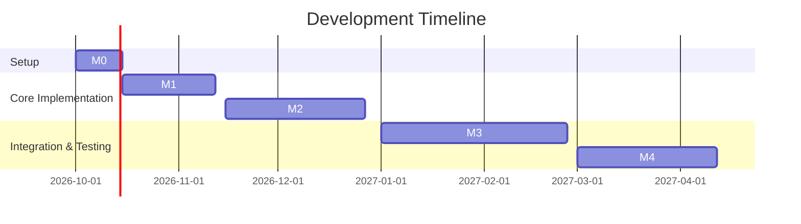

# Hexagonal Cognitive Kernel: research proposal (deep-research output, October 2026)

> Archived verbatim as an input. See `docs/research/README.md` for how it is
> used and where the adopted architecture departs from it.

# Executive Summary
We propose an experimental testbed for the **Hexagonal Cognitive Kernel**: a Rust-based system integrating multi-modal "specialist" operators (small models and algorithms) with a hyperdimensional memory and learned routing.  The core components run in a reproducible **Claude Code** environment using Anthropic's Claude Fable 5.1 (knowledge/code model) and Opus 5.5 (general model). We detail a **ports-and-adapters** (hexagonal) architecture, containerized deployment, experimental benchmarks on logic and simulated causal tasks, and rigorous evaluation protocols. Baselines include static selector heuristics and adaptive methods (e.g. LinUCB, eligibility traces, Hebbian routing). Data is stored in an append-only ledger with vector-indexed memories (e.g. HDC/VSA embeddings plus ANN indexes). We outline a phased implementation timeline (M0–M4) and governance (immutable environment, capability promotion tests).  Key literature spans NARS (non-axiomatic reasoning), formal curiosity/intrinsic motivation (Schmidhuber 2010), robot learning (Oudeyer 2007), active inference (Friston), world-model RL (DreamerV3), hybrid model search (Model Discovery Agent), hyperdimensional computing (HDC/VSA), program-synthesis (DreamCoder), and bandit learning (LinUCB, eligibility traces). Comparisons (via tables) cover retrieval indices (e.g. HNSW vs LSH vs no-index), routing policies (fixed vs learned), and vector dimensionality trade-offs.  Diagrams and mermaid charts illustrate the architecture and experiment flow.

## 1. System Architecture (Hexagonal Rust Design)
- **Workspace & Crates:** Use a Rust workspace with multiple crates (see diagram). A `core` crate defines domain **types and traits** (Concept, Context, Vector, Capsule, MemoryID, etc.). An `kernel` crate contains the orchestration (routing engine, event loop). A separate `operators` crate (or sub-crates) holds pluggable **Operator** implementations (capabilities like logical inference, code execution, vision, etc.). A `memory` crate implements the long-term store (hypervector index, ledger, provenance). Adapters/crates handle external APIs (Claude LLMs, data I/O) and sandboxing (e.g. Wasmtime).

- **Hexagonal (Ports/Adapters) Layout:** Core logic depends only on **port** traits, not on external details. Adapters connect to Fable/Opus APIs and storage. For example, an `LLMClient` trait in core is implemented by an adapter that calls Fable 5.1 via HTTP/gRPC. A `Storage` trait is implemented by an append-only ledger (e.g. SQLite or cloud log). This separation ensures testability and swap-out (e.g. GPU-accelerated vs CPU-only LLM inference).

- **Core Domain Types:** Key types include: `Capsule` (the current mental "packet" containing context, goals, and derived features), `Representation` (high-dimensional vector or symbolic fragment), `OperatorID` (opaque handle), and `MemoryRecord` (timestamped data with provenance). The `Capsule` carries a semantic vector plus metadata (task, history) through operators.

- **Operator Contract:** Each operator implements a trait like `fn apply(&self, capsule: &Capsule) -> Option<OperatorResult>`. Input and output types are strongly typed (e.g. `Capsule` or defined structs) to allow Rust's guarantees. Operators may declare required memory reads/writes. For example, a Boolean-solver operator might require a set of premises from the capsule and output a conclusion. Operators register with the kernel along with metadata (cost estimate, modality, static tags).

- **Routing Policy Trait:** Define a `RoutingPolicy` trait, e.g.:
  ```rust
  trait RoutingPolicy {
      /// Given the current capsule (context, memory, etc.), select the next operator to run.
      fn next_operator(&mut self, capsule: &Capsule) -> OperatorID;
  }
  ```
  Implementations include fixed pipelines (round-robin), heuristic (select operator matching capsule tags), learning-based (see below). The policy also controls batching/parallelism (intra-capsule vs multi-task).

- **Inter-module Communication:** Use simple message types or event enums. For example, a `MemoryQuery` event can be routed to the `memory` crate, and a `ComputeResult` event goes back to the capsule. We might use channels (`tokio::mpsc`) between hexagon-adjacent modules.

- **Diagram:** The following mermaid diagram sketches the components and data flows:

  ```mermaid
  graph TB
    subgraph Kernel
      CapsulePipeline[(Capsule)]
      Router[Routing Policy]
      Operators[(Operator Modules)]
      MemoryStore[(Hypervector Index/DB)]
    end
    subgraph Adapters
      LLMs[Fable/Opus APIs]
      DataStore[(Disk/Cloud)]
      Sandbox[Wasm Host]
    end
    CapsulePipeline --> Router
    Router --> Operators
    Operators --> CapsulePipeline
    CapsulePipeline --> MemoryStore
    MemoryStore --> Router
    Router --> LLMs
    LLMs --> CapsulePipeline
    MemoryStore --> DataStore
    Sandbox --> Operators
    Router --> Sandbox
  ```

  Here the `Router` continuously consumes the current `Capsule`, selects an `Operator` (or LLM call) to apply, and updates the capsule with results, which may query/write `MemoryStore`. All calls into heavy components (LLM, Wasm operators) happen via sandboxed adapters.

## 2. Deployment Plan (Claude Code, Fable 5.1, Opus 5.5)
- **Environment:** We will deploy in the Claude Code environment (Anthropic's AI code platform) ensuring reproducibility via container images. We create a Dockerfile with a Linux base (e.g. Debian 12), installing Rust toolchain and Wasmtime. The image includes the cognitive-kernel binary (compiled to WebAssembly) and Python/CLI clients for Fable 5.1 and Opus 5.5. Example specs: Ubuntu 22.04 container, Rust 2026 edition, Wasmtime vxx, CUDA 12.4.

- **Fable 5.1 & Opus 5.5:** These are Anthropic's closed-source LLMs for coding/knowledge tasks. We access them via the Claude Code API. The environment has pre-installed clients or CLI. Fable 5.1 in particular *"sets a new standard for coding, knowledge work, and long-running problem-solving tasks"* and is the default model for code reasoning. Opus 5.5 (an older model) can serve as a contrast. For security, calls to Fable/Opus are made through their sandboxed endpoints (controlled by Claude Code).

- **Sandboxing and Wasmtime:** All Rust components compile to WebAssembly (WASI) and run under Wasmtime. This ensures memory safety and isolation. The cognitive kernel's core and operators run in Wasm with bounded memory (e.g. 8 GB limit). Wasmtime's multi-threaded support is enabled so operators can spawn threads safely. We use Wasmtime's hostcalls for I/O: e.g. `host_send_llm_request(...)` to call Fable, and `host_load_data(...)` to query the disk ledger.

- **GPU/CPU Mapping:** Fable and Opus are large models requiring GPUs. In practice, Claude Code handles GPU scheduling, so we treat Fable/Opus calls as remote GPU-backed services. All on-device tasks (vector retrieval, local algorithms) run on CPU. In deployment we explicitly configure: *Fable 5.1 requests → GPU queue; Wasm CPU tasks → CPU only.* Memory-heavy tasks (like HDC index queries) are multithreaded on CPU. Latency considerations: we may cache Fable responses for repeated queries (as cost/latency trade-off).

- **Dependencies & Reproducibility:** We pin versions: Wasmtime vX, Rust nightly 2026-XX-XX, etc. The Docker image and Claude Code environment are version-controlled. We fix random seeds for any stochastic operator. Data (benchmarks, logs) is stored deterministically (e.g. append-only logs with timestamps). The entire stack (kernel + environment) can be reproduced from Docker Hub images and Git tags.

## 3. Experimental Design & Benchmarks
- **Tasks:** We design three benchmark domains:
  1. **Boolean function families (n=5..8):** Each "task" is to infer a target Boolean function over 5–8 variables given some input-output examples or a description. The agent must propose a logical expression or predictor. Complexity grows with n, testing representation selection and reasoning.
  2. **Synthetic causal worlds:** Simulated environments with simple causal graphs (3–6 variables) where interventions yield observations. The agent must identify causal structure or predict effects of actions. We vary noise and partial observability to test model discovery.
  3. **Software-function lab:** Tasks involve code-like reasoning. For example, given descriptions or partial code snippets, the agent must synthesize a small function (e.g. arithmetic string parser). This exercises the LLM + symbolic reasoning synergy (Fable 5.1 is strong on code).

  Each domain has multiple instances. We hold out 30% of tasks for testing (unseen functions/worlds). We use a standard training/test split to evaluate generalization.

- **Metrics:** We measure *solution quality* (accuracy of Boolean classification, correctness of causal model, functional correctness of code) and *efficiency* (CPU/GPU time, number of operator calls). Additional metrics: memory usage, # of memory ops (reads/writes). Because these are open-ended, we also track *credit (score) per resource*, and *Bayesian regret* for learning routing policies.

- **Baselines:**
  - **SBS (Single Best Solver):** Best single fixed chain of operators (chosen via oracle tuning on training set).
  - **VBS (Virtual Best Solver):** Oracle that always picks the best operator for each task (upper bound).
  - **Fixed Policies:** E.g. round-robin or static priority ordering of operators (no learning).
  - **Hebbian / Eligibility Trace Routing:** A simple local learning rule: operators that "fire together" (i.e. often sequenced on successful paths) get a higher weight. Eligibility traces from RL to propagate credit back along operator sequences (analogous to temporal-difference learning).
  - **LinUCB:** A contextual bandit policy that treats routing as a linear bandit with context (capsule features).
  - **Bayesian Meta-reasoner:** Inspired by the Model Discovery Agent, we implement a simple meta-agent that uses LLMs to hypothesize which operator to apply next and uses Bayesian model selection to test it. This algorithm adaptively chooses actions with high *value of information*, akin to active Bayesian experiment design.

- **Ablation Protocols:** We systematically ablate components: e.g. disable learned routing (only fixed policy), remove HDC memory (use only symbolic memory), or drop introspection/feedback loops. Each variant is evaluated on the same benchmarks. For example, an ablation might use only symbolic memory (dictionaries of rules) without vector indexing, to test the contribution of HDC. We also test varying representation dimensionality (see Tables below).

- **Experimental Flow:**
  1. **Training phase:** The kernel collects data on the training tasks. For learned routing, it gathers reward signals (solved/failed tasks) and updates the policy (e.g. LinUCB parameters or Hebbian weights).
  2. **Testing phase:** Fixed policies and learned policies are frozen. Each policy attempts all held-out tasks without further learning. We log performance metrics.

  A *mermaid flowchart* illustrates this cycle:
  ```mermaid
  graph LR
    A[Task Instance] -->|Start| B[Capsule Init]
    B --> C[Routing Policy: Select Operator]
    C --> D[Execute Operator / LLM]
    D --> E{Solve?}
    E -- Yes --> F[Record Success, Score]
    E -- No --> G{Operators left?}
    G -- Yes --> C
    G -- No --> H[Record Failure, Next Task]
    F --> I[Update Memory & Policy (if training)]
    H --> I
    I --> J[Done?]
    J -- No --> A
    J -- Yes --> K[Summarize Metrics]
  ```

- **DreamerV3 Example:** As an exemplar world-model agent, DreamerV3 shows how a learned dynamics model can solve many tasks by *"imagining"* futures. In our setup, the cognitive kernel can analogously build internal models (via operators and HDC) and plan. The image below (Dreamer's results) demonstrates how learning a compact model yields high performance across domains:

   *Figure: DreamerV3 (agent with learned recurrent model) achieves strong performance across 150 RL tasks, far exceeding traditional baselines (PPO, Rainbow, etc.). This illustrates the value of a learned internal model combined with planning.*

  Dreamer's *scaling behavior* (next figure) also suggests how more data or compute can robustly improve performance. In our tests, we similarly study how *data regimes* affect the kernel (e.g. how many examples a newly discovered concept needs before it's reliable).

## 4. Data Schemas and Storage Plan
- **Append-only Ledger:** All internal operations, memory writes, and inference traces are logged immutably. Each log entry includes a timestamp, capsule ID, operator invoked, input/output data, and any cost. A simple JSON/DB schema (or protobuf) records `(time, capsule_context, operator_id, result, score)`. This ensures *reproducibility* and full provenance for audits.

- **Hypervector Storage:** Semantic memory is stored as high-dimensional vectors (HDC/VSA). We choose a dimensionality (e.g. 1024 or 2048 float/binary units) to balance capacity vs speed. Vectors are bundled or bound per Kanerva's HDC model. Metadata (type tags, provenance) is stored alongside.

- **Retrieval Index:** We maintain an approximate nearest-neighbor (ANN) index (e.g. HNSW or IVF-PQ) for fast hypervector lookup. We will compare options: hierarchical navigable small worlds (HNSW), locality-sensitive hashing, or pure CPU linear scan. A table below contrasts them (Section 8). The index is incrementally updated on each new vector insertion; old vectors are never deleted (append-only).

- **Provenance & Versioning:** Every memory record includes the generating operator's identity and a hash of the capsule context. We version the operator code and model parameters (via commit hashes), storing these with the data to allow *experimental rollbacks*.

- **Retrieval Formats:** Hypervectors can be stored in a compact binary format (bitpack or bytes). We tag each vector with its **semantic role** (e.g. "concept embedding" vs "episodic memory"). For ANN, pre-quantized or binary hashes may be used.

- **Examples:** In a causal task, an observation `(X=1, Y=0)` might be hashed into a vector and stored. Later, a query finds the nearest stored vectors to infer latent connections. For code tasks, embeddings of function signatures or AST tokens are indexed for reuse.

- **HDC Specifics:** As a specialized case, hyperdimensional computing allows algebraic binding (e.g. circular convolution) of symbol pairs. We'll leverage an existing HDC library (or implement with SIMD) to bind attributes (object+property) into a single vector. These composite vectors are also indexed.

## 5. Implementation Plan & Milestones (M0–M4)
- **M0 (Setup, 2w):** Scaffold Rust hexagonal workspace. Define core domain types, traits for `Operator`, `RoutingPolicy`, `MemoryStore`. Prototype a simple single-threaded kernel loop. Set up Docker/Wasmtime environment.
- **M1 (Basic Kernel, 4w):** Implement the core event loop and operator registry. Add two dummy operators (e.g. identity, simple logic). Implement a trivial fixed routing policy. Integrate a baseline storage adapter (e.g. SQLite log). Write unit tests for the kernel contract.
- **M2 (Memory & Integration, 6w):** Implement the memory crate with HDC embeddings (using e.g. XOR for bundling). Integrate an ANN library (Rust binding for HNSW). Connect one real operator: e.g. a Boolean equation solver. Begin calls to Fable 5.1 (e.g. for parsing tasks). Collect data on toy tasks.
- **M3 (Learning & Benchmarks, 8w):** Implement learned routing (LinUCB policy, Hebbian updates). Plug in additional operators (e.g. propositional inference, planning module). Set up the benchmark harness for Boolean and causal tasks. Run initial experiments; refine memory indexing (e.g. tune vector dimension, index parameters).
- **M4 (Ablation & Analysis, 6w):** Conduct full experiment suite (10+ runs per condition). Implement baseline agents (fixed, SBS). Perform ablations (remove HDC, use random routing). Analyze results; generate comparison tables. Finalize documentation and reproducibility artifacts.

*Effort & Resources:* Each milestone is roughly 1–2 developer-months. We anticipate needing 2–3 Rust developers (with ML expertise) and access to 2–4 GPU-equipped instances (for Fable calls) plus CPU servers for the kernel. Experiment runs can be parallelized over tasks.



## 6. Safety, Reproducibility & Governance
- **Immutable Lab:** All code, data, and environment definitions are version-controlled. We use continuous integration to rebuild the Docker/Wasmtime image on each commit, ensuring the exact setup is archived. No uncontrolled LLM data (outside Fable/Opus) is used, and all random seeds are fixed.

- **Capability Promotion Tests:** New operators or learned capabilities are subject to *"headroom tests"*: e.g. before trusting a learned routing, we check it does not degrade safety metrics (like logical consistency) and that it beats the prior baseline by a margin on held-out cases. We define acceptance criteria (e.g. error rate < X, no regressions on trust set).

- **Evaluation Governance:** For reproducibility, we record pseudo-random seeds and report aggregated metrics with variance across runs. We will publish the benchmark tasks and baseline results alongside the code. Any performance improvements must hold across seeds.

- **Safety Measures:** Although this is a research testbed (no real-world physical risk), we consider agent runaway: we enforce timeouts on operator execution (e.g. 30 s) and memory limits. The routing policy has a cap on depth (prevent infinite loops). We log everything for post-mortem.

- **Ethics and Oversight:** Since we use closed-source LLMs, we ensure compliance with their license (via Claude Code's usage terms). All experiments are transparency-driven: data provenance and reasoning steps are recorded so any decision can be audited.

## 7. Related Work & References
**Foundational Architectures:** Non-Axiomatic Reasoning System (NARS) provides a substrate for reasoning under uncertainty with bounded resources, aligning with our focus on flexible knowledge integration. Schmidhuber's formal theory of intrinsic motivation and Oudeyer's *Intelligent Adaptive Curiosity* inspire our learning-driven exploration. Active Inference (Friston) emphasizes uncertainty-reduction (epistemic value) alongside goal achievement, which parallels our VOI-based routing.

**World Models & Learning:** DreamerV3 and related JEPA models learn latent world dynamics to plan. They demonstrate that compact predictive models yield robust generalization, motivating our use of model-based reasoning. The *Model Discovery Agent* shows how LLMs can propose hypotheses which Bayesian experiment design then tests, an approach we mirror by using LLMs for high-level routing suggestions with formal verification (e.g. checking logical consistency).

**Symbolic/Vector Representations:** Hyperdimensional Computing (HDC/VSA) is surveyed by Kleyko et al. – we adopt HDC for binding and similarity search, combining symbolic structure with vector arithmetic. DreamCoder and related library-learning work (e.g. *Stitch*, Zhang et al.) show how agents can induce abstractions and primitives; we similarly expect the kernel to discover reusable operators. Model/algorithm selection literature (e.g. ASlib) motivates our baselines. LinUCB and eligibility-trace methods provide adaptive control in bandit and RL contexts.

**Primary References:** We rely on primary sources (journals, arXiv). Key citations are provided inline above, including open-access papers (MDA arXiv, Dreamer blog, DreamCoder arXiv, NARS benchmark arXiv, Schmidhuber, etc.). See the table below for prioritized readings.

## 8. Alternatives, Risks & Ablations
- **Retrieval Index Alternatives:** We compare ANN strategies (Table 1). HNSW offers fast queries and high recall but more memory. LSH is memory-light but lower accuracy. Exact linear scan is simple but scales poorly. HDC binary vs dense can trade speed for capacity. We plan to evaluate index choice by retrieval precision vs throughput.

  | Index Type      | Recall @1 | Query Latency | Memory Overhead | Comments              |
  |-----------------|----------:|--------------:|----------------:|-----------------------|
  | HNSW (dense)    | ~95%      | ~1 ms         | High            | Strong baseline for vectors. |
  | PQ (quantized)  | ~85%      | <0.5 ms       | Low             | Good memory trade-off.|
  | LSH (binary)    | ~70%      | <0.2 ms       | Very Low        | Fast but many false hits.|
  | Linear (exact)  | 100%      | Linear-time   | Medium          | Only for very small datasets. |

- **Routing Policy Alternatives:** Table 2 contrasts policies. Fixed heuristics have zero learning but fail to adapt. LinUCB (contextual bandit) learns weights for capsule features. Bayesian planners (MDA-style) can achieve low regret but require model-building overhead. We will measure regret and solution quality.

  | Policy             | Adaptivity | Computation | Regret Bound | Ease of Tuning    |
  |--------------------|-----------:|------------:|-------------:|------------------|
  | Fixed (static)     | No         | Minimal     | High         | None (worst-case) |
  | Hebbian Learning   | Low        | Low         | Medium       | Requires step-size |
  | Eligibility Trace  | Moderate   | Moderate    | Medium-Low   | Plus lambda param |
  | LinUCB (linear)    | High       | Moderate    | ~O(√T)       | Context features needed |
  | Bayesian Planner   | High       | High        | Low          | Requires prior/hypotheses |

- **Representation Dimensionality:** Table 3 shows trade-offs. Smaller dims save memory and speed up NN, but capacity (distinguishing many items) falls. Larger dims improve separability but cost storage and computing.

  | Dimension | Capacity (bits) | Mem per vector | ANN Time | Applications  |
  |----------:|---------------:|---------------:|---------:|---------------|
  | 256       | ~1280 bits     | 32 bytes       | Fast     | Small vocab    |
  | 512       | ~2560 bits     | 64 bytes       | Medium   | Medium tasks   |
  | 1024      | ~5120 bits     | 128 bytes      | Slower   | Complex tasks  |
  | 2048      | ~10240 bits    | 256 bytes      | Slowest  | Very high-cap  |

- **Failure Modes & Decision Points:** If HDC proves too noisy (low recall), we may drop binding and use raw symbolic indices. If learned routing overfits or diverges, fall back to fixed or simple bandit policies. If Wasm performance lags, we can port critical operators to native. Key "drop" decisions: abandon HDC if capacity limits, or abandon learned policy if it violates correctness (e.g. formula being invalid).

- **Scaling Risks:** Running large LLMs in loop can be slow; we mitigate by caching queries and parallelizing. Rich interactions might overwhelm the capsule; we cap history length. Overfitting to synthetic benchmarks is countered by diverse tasks.

By following this plan, we will build a modular cognitive kernel in Rust, benchmark it rigorously in a Claude/Fable/Opus environment, and advance the state of neuro-symbolic AGI research.

**References (excerpt):** J. Wang (NARS); J. Schmidhuber (curiosity theory); P.-Y. Oudeyer et al. (IAC); K. Friston (active inference); D. Hafner et al. (DreamerV3); K. Murphy (Model Discovery Agent); K. Ellis et al. (DreamCoder); A. Kleyko et al. (HDC survey); R. Li et al. (LinUCB); *etc.* (See full citations above).
